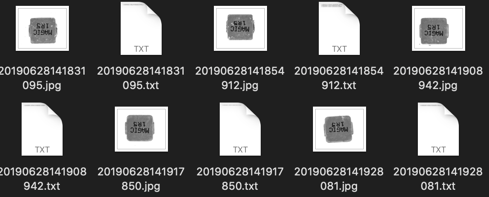
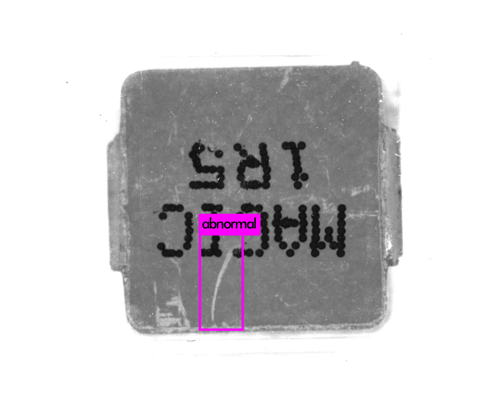
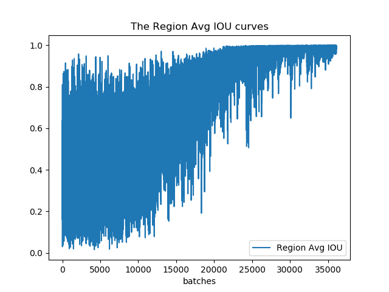
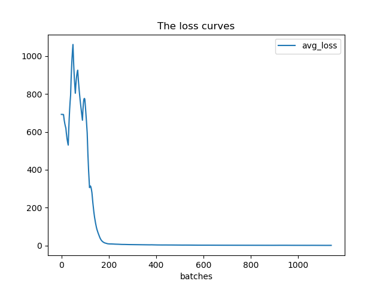
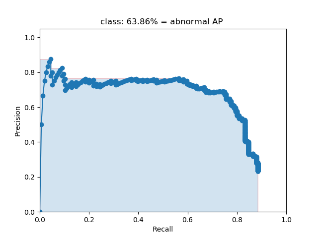

# industrial_abnormal_yolo

### Using  `darknet`  to train yolov3 model

## How to run

### 1. Clone Darknet

There are 2 ways :

1. You can directly use codes in `darknet ` folder. (You may need follow tutorial on the websit shown in the second way on **Windows** platform to recompile)
2. You can simply delete existed `darknet` folder and run `git clone https://github.com/AlexeyAB/darknet.git` in the same folder. Then you can follow the tutorial on this website https://github.com/AlexeyAB/darknet .

### 2. Prepare data

1. Put all of images in `darknet/train/` or any other path you like.

2. For each one of images, generate a `.txt` file with same name in which is like this:

   ```
   0 0.6895424836601307 0.44140625 0.05147058823529412 0.0693359375
   0 0.31147875816993464 0.47998046875 0.05024509803921569 0.0732421875
   ```

   Meaning of each number:

   1. Class number
   2. The x-coordinate of normalized center point
   3. The y-coordinate of normalized center point
   4. The x-coordinate of normalized target's width
   5. The x-coordinate of normalized target's height

    You can easily get tutorial about this by Google.

3. Generate a txt file in which each line is a path to an image for training. Name it as `train.txt`

   

4. Prepare validation set in the same way.

5. Create `obj.name` file in which each line corresponds to the name of each class number.

Contact me if you want to try industrial abnormal data.

### 3. Setting

1. Open `darknet/Makefile` and you can set your compile configurations.

   ```python
   GPU=0
   CUDNN=0
   OPENCV=0
   OPENMP=0
   DEBUG=0
   ```

   0 means disabling this option, and 1 means enabling.

2. Open `darknet/cfg/`. Then you can see a lot of yolo models. Choose one of them, for example `yolov3.cfg` . At the beginning, you set model parameters. Here are some parameters you may change:

   ```python
   # Testing uncomment following two lines when testing
   # batch=1
   # subdivisions=1
   # Training
   batch=64
   subdivisions=64
   width=416
   height=416
   ```

   **ATTENTION** Most important part to set is the class number. There are three `[yolo]` part in the model. Change all of their `classes` to yours and set all of the `filters` in  `[convoluntional]` parts just before `[yolo]`  to be `3*(classes+1+4)` .

3. Create `obj.data` and its content is like following:

   ```
   classes= 1						# number of classes
   train = ./train.txt		# path to train set folder
   valid = ./train.txt		# path to valid set folder
   names = ./obj.names		# path to obj.names created in previous step
   backup = ./output/		# path to folder which save the model weights
   ```

### 4. Train

1. Download pre-trained weights by https://pjreddie.com/media/files/darknet53.conv.74. Or you can directly use downloaded one in `darknet`

2. run command in `darknet` folder (Mac or Linux)

   It will generate train log in `train.log`

   ```shell
   ./darknet detector train obj.data cfg/yolov3.cfg darknet53.conv.74 >> train.log
   ```

### 5. Test

The model weights are in the path you set in `obj.data`. You can just use following command to test one image

```
./darknet detector test obj.data cfg/yolov3.cfg output/yolov3_1000.weights train/20190628141831095.jpg
```



### 6. Evaluation

1. Run `python log_transformer.py` to transform train log.

2. Run `python iou_draw.py` to visualize IOU.

   

3. Run `python loss_draw.py` to visualize loss.

   

4. Run command `./darknet detector valid obj.data cfg/yolov3.cfg output/yolov3_200.weights` 

   You can find valid results in `darknet/results/comp4_det_test_abnormal.txt`

   The content looks like following:

   ```
   20190628144629832 0.182705 177.825806 588.880005 2448.000000 749.905396
   20190628144629832 0.096559 1019.806885 1163.286255 1929.701904 1384.190796
   20190628144629832 0.095504 1.000000 153.420364 2448.000000 643.597717
   20190628144629832 0.088120 1005.774109 885.752563 1432.554199 1645.059204
   20190628144629832 0.081529 978.469360 294.323853 1779.933472 2048.000000
   ```

   Meaning of numbers:

   1. Time
   2. Confidence Ratio
   3. The x-coordinate of left-top point
   4. The y-coordinate of left-top point
   5. The x-coordinate of right-bottom point
   6. The y-coordinate of right-bottom point

5. Copy `.txt` file of each validation sample into `darknet/lables/`

6. Run `python convert_gt.py` to transform coordinates.

7. Run `python convert_results.py` to transform validation log.

8. Visualization part is based on [mAP](https://github.com/Cartucho/mAP).

   Run`cd mAP/scripts/extra`

   `python intersect-gt-and-dr.py` to get the intersection of validation results and ground truth.

9. Then goto `mAP` folder and run `python main.py`. You can see several analysis results in folder `results`.

   